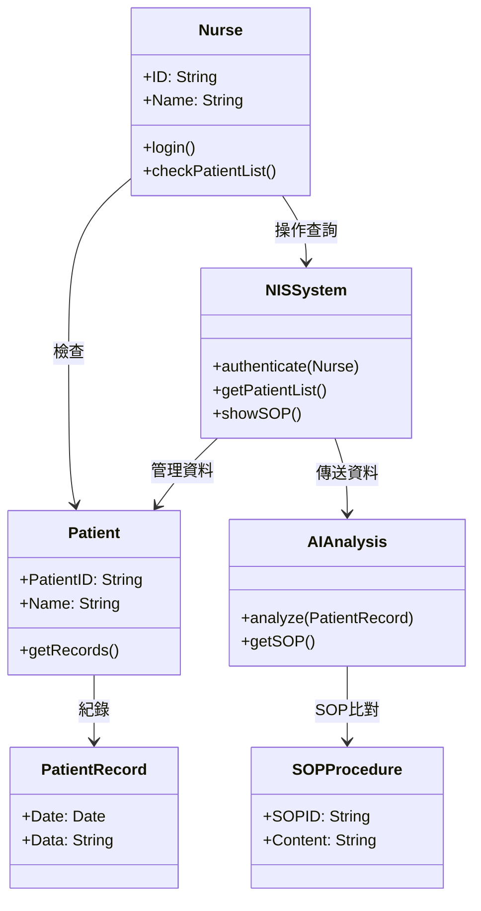
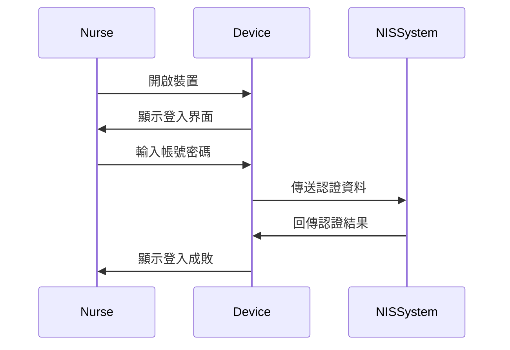
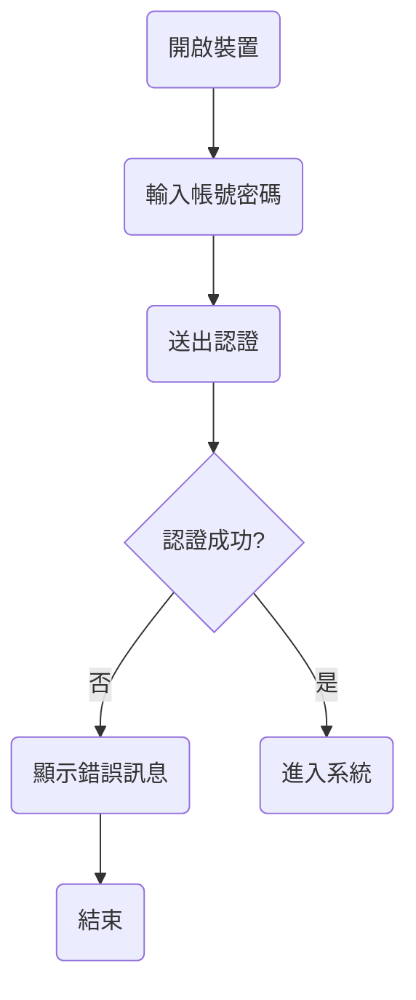
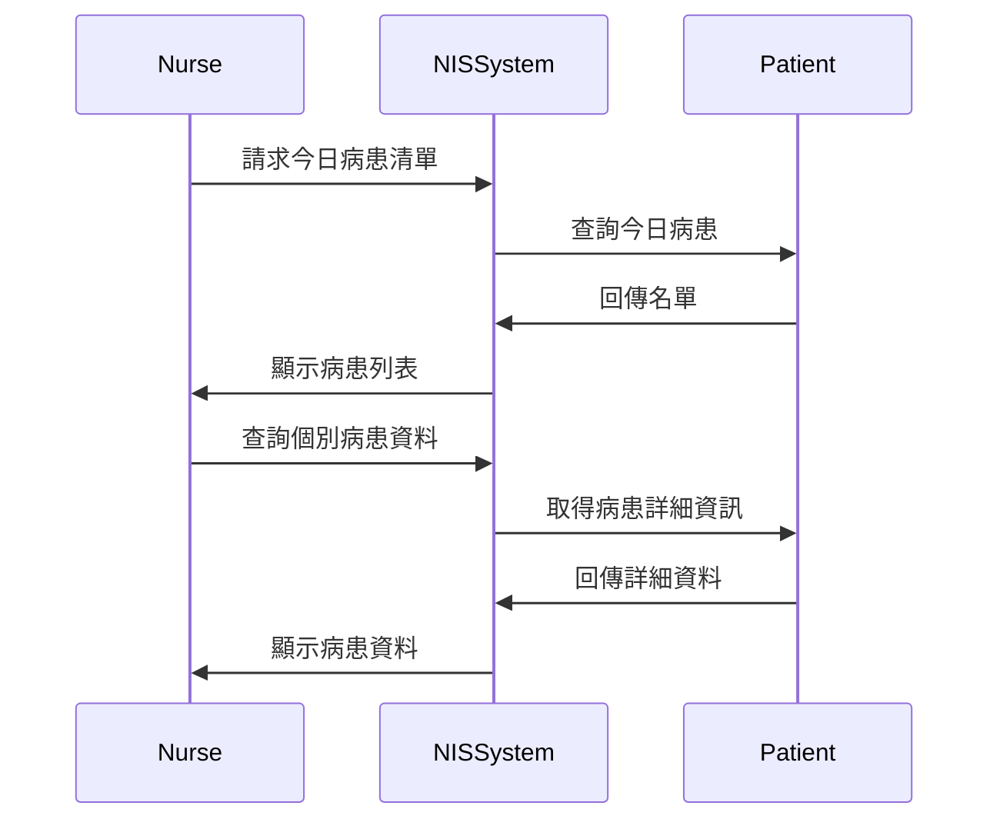
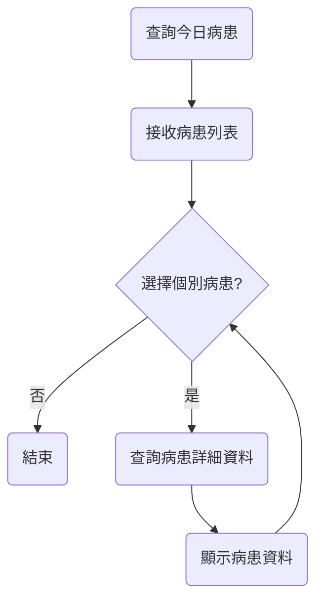
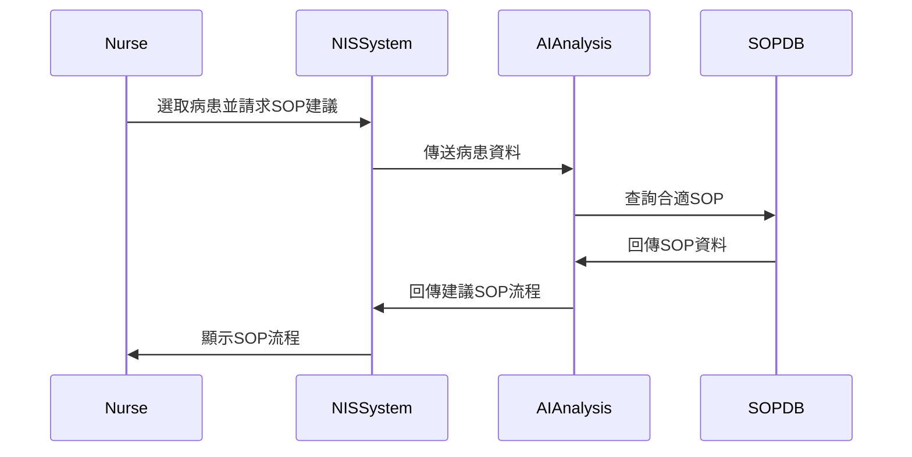
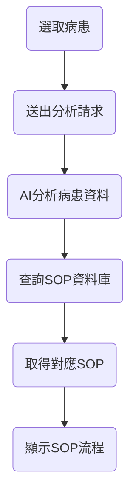

1. UML 類別圖 (Class Diagram)

```mermaid
classDiagram
    class Nurse {
        +ID: String
        +Name: String
        +login()
        +checkPatientList()
    }
    class Patient {
        +PatientID: String
        +Name: String
        +getRecords()
    }
    class PatientRecord {
        +Date: Date
        +Data: String
    }
    class NISSystem {
        +authenticate(Nurse)
        +getPatientList()
        +showSOP()
    }
    class AIAnalysis {
        +analyze(PatientRecord)
        +getSOP()
    }
    class SOPProcedure {
        +SOPID: String
        +Content: String
    }
    Nurse --> NISSystem : 操作查詢
    Nurse --> Patient : 檢查
    Patient --> PatientRecord : 紀錄
    NISSystem --> Patient : 管理資料
    AIAnalysis --> SOPProcedure : SOP比對
    NISSystem --> AIAnalysis : 傳送資料
```

2. UML 使用案例 (Use Cases) 與圖示
使用案例1：護理師登入與身分驗證

```mermaid
sequenceDiagram
    participant Nurse
    participant Device
    participant NISSystem

    Nurse->>Device: 開啟裝置
    Device->>Nurse: 顯示登入界面
    Nurse->>Device: 輸入帳號密碼
    Device->>NISSystem: 傳送認證資料
    NISSystem->>Device: 回傳認證結果
    Device->>Nurse: 顯示登入成敗
```

活動圖

```mermaid
flowchart TD
    A(開啟裝置) --> B(輸入帳號密碼)
    B --> C(送出認證)
    C --> D{認證成功?}
    D --否--> E(顯示錯誤訊息)
    E --> F(結束)
    D --是--> G(進入系統)


```

使用案例2：查詢今日需檢查的病患

```mermaid
sequenceDiagram
    participant Nurse
    participant NISSystem
    participant Patient

    Nurse->>NISSystem: 請求今日病患清單
    NISSystem->>Patient: 查詢今日病患
    Patient->>NISSystem: 回傳名單
    NISSystem->>Nurse: 顯示病患列表
    Nurse->>NISSystem: 查詢個別病患資料
    NISSystem->>Patient: 取得病患詳細資訊
    Patient->>NISSystem: 回傳詳細資料
    NISSystem->>Nurse: 顯示病患資料
```
活動圖

```mermaid
flowchart TD
    A(查詢今日病患) --> B(接收病患列表)
    B --> C{選擇個別病患?}
    C --否--> D(結束)
    C --是--> E(查詢病患詳細資料)
    E --> F(顯示病患資料)
    F --> C
```
使用案例3：AI分析與顯示對應SOP流程

```mermaid
sequenceDiagram
    participant Nurse
    participant NISSystem
    participant AIAnalysis
    participant SOPDB

    Nurse->>NISSystem: 選取病患並請求SOP建議
    NISSystem->>AIAnalysis: 傳送病患資料
    AIAnalysis->>SOPDB: 查詢合適SOP
    SOPDB->>AIAnalysis: 回傳SOP資料
    AIAnalysis->>NISSystem: 回傳建議SOP流程
    NISSystem->>Nurse: 顯示SOP流程

```
活動圖

```mermaid
flowchart TD
    A(選取病患) --> B(送出分析請求)
    B --> C(AI分析病患資料)
    C --> D(查詢SOP資料庫)
    D --> E(取得對應SOP)
    E --> F(顯示SOP流程)
```
